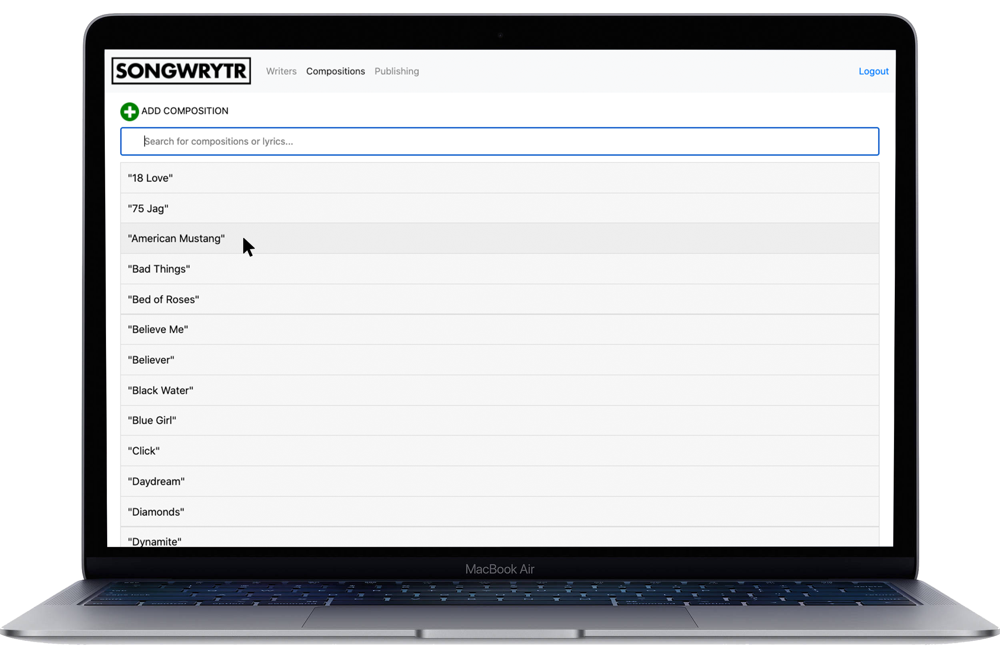
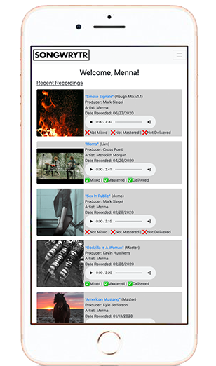
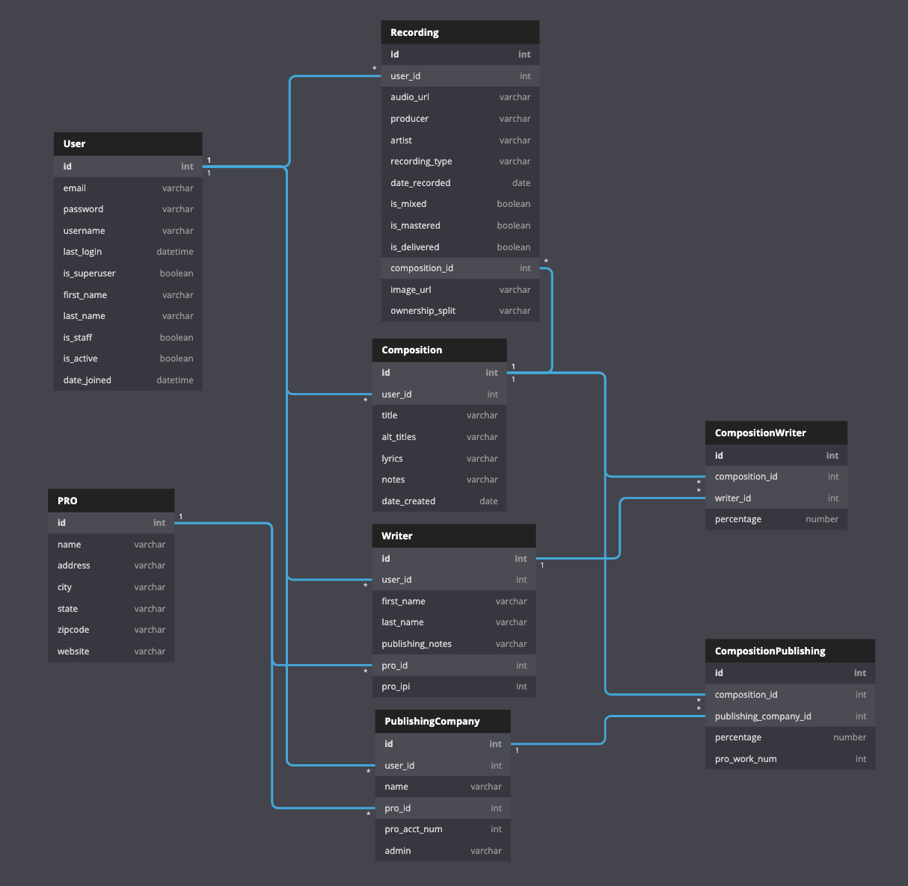

A back-end capstone project from [Landon Morgan](https://github.com/iandonmorgan) for [Nashville Software School Web Development Cohort 38](https://github.com/nss-day-cohort-38)



## Navigating Account Creation, Log-In, and Entering Data

A user can create an account, log-in, and enter data for Writers, Publishing Companies, and Compositions. User-specific data can be created, read, updated, and deleted. Users are able to search compositions based on titles, lyrics, and notes entered.


## Navigating the Dashboard and Composition Details


The first time a user logs in, their dashboard is empty, but for users with data entered, the dashboard will display the most recent 5 recordings recorded and most recent 5 compositions written. The dashboard can be accessed by clicking the SONGWRYTR logo in the top left corner, if navigating other parts of the app.

Inside a composition, a user can attach or remove Writers and Publishing Companies, designating a percentage split based on their writing arrangement, as well as CRUD functionality for information tied to a recording of that composition, including link to recording audio, artwork. Info can be entered for all recordings on a specific composition, as a way to track recorded versions of a song.

## Brief Proposal

Songwriters create intellectual property in the form of songs. This app will solve the problem of tracking information associated with creating this IP, including co-writer(s), percentage split(s), publisher(s), performance rights organization(s), and licensing contact information, specific to each user (songwriter).

## Project Definition

* FULL STACK application written in PYTHON using DJANGO framework
* Ability to create, read, update, and delete user-specific data

## Setup

Steps to get started:
1. `git clone git@github.com:iandonmorgan/back-end-capstone.git`
1. `cd` into directory created and `cd` into `songwrytrapp` directory where the `manage.py` file is; set up your virtual environment:

#### Mac users, run the following:
```sh
python -m venv songwrytrenv
source ./songwrytrenv/bin/activate
pip install django
pip freeze > requirements.txt
```
#### Windows users, run the following:
```sh
python -m venv songwrytrenv
source ./songwrytrenv/Scripts/activate
pip install django
pip freeze > requirements.txt
```
> Note the separate formats for the `source` command between Windows and Mac users. You will use this command each time you activate your virtual environment for this project.

3. Run a database migration using the `migrate` command, below, to create a set of tables that Django maintains for user management.

```sh
python manage.py makemigrations songwrytrapp
python manage.py migrate
```

4. Load Performance Rights Organization fixtures by using command, `python manage.py loaddata PROs`
4. Start application using command, `python manage.py runserver`
4. Navigate browser to [http://localhost:8000](http://localhost:8000)

## Entity Relationship Diagram

